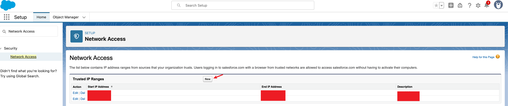

<!-- <p align="center" style="font-size: 30pt;">
  SCUBA: Salesforce Computer Use Benchmark
</p> -->
# SCUBA: Salesforce Computer Use Benchmark

<p align="center">
•
  <a href="https://sfrcua.github.io/SCUBA/">Website</a> •
  <a href="https://arxiv.org/abs/2509.26506">Paper</a> •
  <a href="https://github.com/SalesforceAIResearch/SCUBA/blob/main/data">TestCases</a> •
</p>

<p align="center">
    <a href="https://img.shields.io/badge/PRs-Welcome-red">
        
    </a>
    <a href="https://opensource.org/licenses/Apache-2.0">
        
    </a>
    <br/>
</p>


## 📢 Updates

- [2025-09-30] SCUBA paper is now available on [arXiv](https://arxiv.org/abs/2509.26506)!


# ☁️ Setup your Salesforce Developer Org


## 🏢 Apply for a developer org

To apply for a developer org, please visit this [link](https://www.salesforce.com/form/developer-signup/?d=pb). You need to fill the required information and submit the form. Make sure the Work Email is your real email that can receive the verification code. Other fields can be filled with any information. Once the form is submitted, you will receive an email with a link to reset the password.
Please follow the instructions you received by email to access the org.

Take a note of the `username` and `password` for the next step.

## 🔐 Get your consumer key and secret

Please refer to [this tutorial](./tutorials/get_consumer_key_secrete.md) for detailed instructions for the following steps.
After this exercise you should have the following values


- `org_alias`: the value used to fill the `External Client App Name` section. In this example, it is `YDSampleOrg`
- `client_key`: Copied value from Consumer Key
- `client_secret`: Copied value from Consumer Secret
- `username`: value should be the system administrator user you mentioned in the `Run As` field. In this example, it is `xxx@agentforce.com`.
- `instance`: URL of your instance. Make sure this ends with `my.salesforce.com`. You can find this url when you obtain the `Consumer Key and Secret`. In this example, it is `https://orgfarm-ae27993685-dev-ed.develop.my.salesforce.com`


<p align="center">
  
</p>


# Create your SCUBA evaluation environment

## 🐍 Python environment

```bash
conda create -n scuba python=3.12.9
conda activate scuba
pip install -r requirements.txt
# if you want to test the browser use agents, then run the following lines
pip install -r requirements_bu.txt
playwright install  
playwright install chromium
# if you want to test the computer use agents, then run the following lines
pip install -r requirements_cu.txt
pip install flash-attn==2.7.4.post1 --no-build-isolation
```

## 📦 Salesforce CLI 
```bash
brew install npm
npm install @salesforce/cli@2.86.9 --global
```

## ℹ️ Add your org information

Add your org information to `orgs/orgs_info.json` by 1) copying the `orgs/orgs_info.json.example` file to `orgs/orgs_info.json` and  2) replacing the placeholder values with your own. Make sure the `org_alias` is replaced with the one you used to fill the `External Client App Name` section.

```json
{
  "<org_alias>": {
    "client_key": "your_client_key",
    "client_secret": "your_client_secret",
    "username": "your_username",
    "instance": "your_instance_url"
  }
}
```

**To test if the org information is added correctly, you can run `python tests/test_add_new_org.py`. It will print `Login successful for the org: {ORG_ALIAS}` if the org information is added correctly.**


## Temporarily By-pass two-way authentication
- Click the `Setup` gear icon in the top right corner of the page and click `Setup` under the `Setup Menu`.
- In the `Quick Find` search bar (left side panel), type `Network Access`. And add the `ip address` of your machine to the `Trusted IP Ranges`.
- To get your machine's ip address, you can run `curl ifconfig.me` in the terminal. (The `ip` should be the machine where you launch the browser environment / desktop environment.)




The system might clear the ip address you added after some time. You can add the ip address again by following the same steps.


## 🖥️ Desktop Environment Setup (Optional)

One needs to host the desktop environment in order to test the computer-use agents. Our implementation largely reuses [OSWorld](https://github.com/xlang-ai/OSWorld). In this repo, we provide insturctions to host desktop environments on the GCP using Docker. If one wants to host the desktop environment according to your setup, please refer to the [OSWorld](https://github.com/xlang-ai/OSWorld) instructions and stop here.

On the GCP server, copy the `envs/remote_docker_env` directory to the GCP server and follow the instructions in the [readme](envs/remote_docker_env/readme.md). Please also refer to the OSWorld's repo if you have issues with the installation. Note that you do not need to setup the account and credentials for Google and Google Drive nor proxy for the VM.

## ℹ️ Configure the environment variables

Make a copy of the `.env.example` file and name it `.env`. Modify the following environment variables to your `.env` file:
```
# API providers (optional)
OPENAI_API_KEY=<your-openai-api-key>
ANTHROPIC_API_KEY=<your-anthropic-api-key>
GOOGLE_APPLICATION_CREDENTIALS=<your-google-application-credentials-path>
GOOGLE_PROJECT_ID=<your-google-project-id>
GOOGLE_REGION=<your-google-region>
# Browser use environment variables
BROWSER_USE_LOGGING_LEVEL=info
ANONYMIZED_TELEMETRY=false
# Salesforce environment variables
ORG_ALIAS=<your-org-alias>
SALESFORCE_USERNAME=<your-salesforce-username>
SALESFORCE_PASSWORD=<your-salesforce-password>
# Docker environment variables (only if you host the desktop environment on the GCP server)
DOCKER_PROVIDER_HOST=<your-server-ip>
DOCKER_PROVIDER_PORT=<your-server-port>
```


# 🚀 Get Started

⚠️ If this is the first time you are running the code, it can take a while to get a snapshot of your developer org. You will see `orgs/initial_state/{ORG_ALIAS}`, `orgs/modified_state/{ORG_ALIAS}`, and `initial_data/{ORG_ALIAS}` directories being created.

## 🌐 Evaluate the browser-use agents

Before evaluating the browser-use agents, you need to make sure that the you can successfully log in to Salesforce. Please run
```python
python scripts/manual_login_to_sf.py --mode bu
```
It will log in to Salesforce. If you are blocked by the two-way authentication, please refer to the [FAQs](#two-way-authentication-issue) section.

After confirming that you can successfully log in to Salesforce, you can start evaluating the browser-use agents.
Make a copy of the `examples/bu_claude4_zero_shot.sh.example` file and rename it as `examples/bu_claude4_zero_shot.sh`. Replace the placeholder values with your own. Then run
```bash
bash examples/bu_claude4_zero_shot.sh
```
If you want to observe the agent run, you can remove the `--headless` flag in the `examples/bu_claude4_zero_shot.sh` file.

After the run, you should expect to see the outputs in the `outputs` directory. We provide sample outputs in the `examples/sample_outputs/demo_bu_claude4`. 

## 🤖 Evaluate the computer-use agents

Before evaluating the computer-use agents, you need to make sure that the you can successfully create the desktop environment and log in to Salesforce. Please run
```python
python tests/test_create_remote_desktop.py
```
It will create a desktop environment and log in to Salesforce. You can check the `tmp` directory to see the screenshot of the desktop environment and the screenshot after logging in to Salesforce. Don't panic if you see the error message
```
Failed to login to Salesforce: Locator.click: Timeout 30000ms exceeded.
Call log:
  - waiting for get_by_role("button", name="App Launcher")
```
This is because some pop-up windows may block the app launcher button. You can just ignore this error and continue. However, during the evaluation, this error will terminate the evaluation for the assinged task immediately since we want to make sure the initial observation is consistent for all the runs. If you would like to change this behavior, you can modify the `envs/remote_docker_env/remote_desktop_env.py` file by wrapping the `page.get_by_role("button", name="App Launcher").click()` with a try-except block.
```python
try:
    page.get_by_role("button", name="App Launcher").click()
except Exception as e:
    logger.warning(f"{str(e)}.\n Skip the initialization.")
```
If you see `tmp/screenshot.png` and `tmp/screenshot_after_login.png`, then you have successfully created the desktop environment and logged in to Salesforce.

### 🤵🏻 self-served agents 🤵🏻‍♀️

#### Serve via vLLM

1. Serve the agents via vLLM. Make a copy of the `scripts/serve_vllm_multi.sh.example` file and name it `scripts/serve_vllm_multi.sh`. Replace the placeholder values with your own. Then run
    ```bash
    bash scripts/serve_vllm_multi.sh
    ```
    To check if the service is running, you can run
    ```python
    python tests/test_vllm_service.py
    ```
    You should see the outputs in the terminal something similar to below.
    ```text
    Prediction:
    Thought: I noticed that there is a "More" button in the top right corner of the page, which should be the gateway to access additional features. To locate the object manager, I need to click on this button first to expand more options.
    Action: click(start_box='(1790,184)')
    Actions:
    ['import pyautogui\nimport time\n\'\'\'\nObservation:\n\n\nThought:\nI noticed that there is a "More" button in the top right corner of the page, which should be the gateway to access additional features. To locate the object manager, I need to click on this button first to expand more options.\n\'\'\'\n\npyautogui.click(1778.882, 181.978, button=\'left\')']
    Usage:
    {'completion_tokens': 70, 'prompt_tokens': 2975, 'total_tokens': 3045, 'prompt_tokens_details': None}
    ```
    If you encounter any issues, you can check the `tmp/vllm_log_file.log` file for debugging.

2. Make a copy of the `examples/uitars15_zero_shot.sh.example` file and rename it as `examples/uitars15_zero_shot.sh`. Replace the placeholder values with your own. Then run
    ```bash
    bash examples/uitars15_zero_shot.sh
    ```
    To check if the evaluation is successful, you can check the `outputs` directory. You should see the files in the `outputs` directory, including the trajectory files, the performance metrics, and the main log file.


#### Serve via Ray

This is specifically for the OpenCUA agent. First, install the dependencies for the OpenCUA agent.
```bash
conda create -n opencua python=3.10.18
conda activate opencua
pip install -r requirements_ray_opencua.txt
```
Then, make a copy of the `scripts/launch_opencua_service_batch.sh.example` file and rename it as `scripts/launch_opencua_service_batch.sh`. Replace the placeholder values with your own. 

1. Launch the Ray Serve service
    ```bash
    bash scripts/launch_opencua_service_batch.sh
    ```
    To check if the service is running, please run
    ```python
    python tests/test_ray_serve_opencua_batch.py
    ```
    You should see the outputs in the terminal something similar to below.
    ```text
    User instruction: Help me to navigate to the object manager since I want to create a new object.
    Low level instruction: Click on the "More" menu in the top navigation bar to expand additional options.
    Pyautogui actions: ['pyautogui.click(1769, 180)']
    Other COT: {'action': 'Click on the "More" menu in the top navigation bar to expand additional options.', 'original_code': '```python\npyautogui.click(x=1781, y=182)\n```', 'code': 'pyautogui.click(1769, 180)'}
    Usage: {'prompt_tokens': 3214, 'generated_tokens': 308, 'total_tokens': 3522}
    GPU ID: 7
    Batch size: 6ba8101d:1
    ```
2. Make a copy of the `examples/opencua_zero_shot.sh.example` file and rename it as `examples/opencua_zero_shot.sh`. Replace the placeholder values with your own. Then run
    ```bash
    bash examples/opencua_zero_shot.sh
    ```

### API-based agents

Please refer to the `examples/opencua_zero_shot.sh.example` file

# 🏃💨 Full Evaluation

We provide scripts under `scripts/reproduce` to reproduce the full evaluation.

Depending on the setup, you can choose the `data/test_zero_shot.json` or `data/test_demo_aug.json` to evaluate the agents under the zero-shot setting and the demonstration-augmented setting, respectively.

We support rerun failed tasks. By simply adding the `--rerun_failed_tasks` flag to the evaluation script, the system will only rerun the failed tasks.


# 🔬 Trajectory Viewer
We provide trajectory viewers for the browser-use and computer-use agents. To use the trajectory viewer, you need to have the trajectory files. Our experiment scripts will save the trajectory files in the `outputs` directory (you can change the directory by modifying the `--result_dir` flag in the evaluation script). To view the trajectory, run
```
cd gradio
gradio main_bu.py # if you want to view the browser-use trajectory
gradio main_cua.py # if you want to view the computer-use trajectory
```
We provide sample trajectory files in the `examples/sample_outputs` directory. You can use the trajectory viewer to view the trajectory. Modify the `DEFAULT_EXP_DIR` in `gradio/main_bu.py` and `gradio/main_cua.py` to point to the directory where the trajectory files are saved in your use cases.

Sample screenshots of the trajectory viewer are shown below.

Browser-use trajectory viewer:
<div style="display:flex; justify-content:center; gap:20px;">
  
</div>

Computer-use trajectory viewer:
<div style="display:flex; justify-content:center; gap:20px;">
  
</div>

# ❓FAQs

## Two-way authentication issue

If you still face the two-way authentication issue, after you whitelist your ip address, then you can try mannual login in to Salesforce, filling the verification code sent to your email. After the login is successful, the system will whitelist your ip address. You may need to run this more than once depending the frequency of the two-way authentication issue. We observed this issue when tetsting in different machines/servers.

1. If you are testing the computer-use agents, please run `python tests/test_create_remote_desktop.py` first on the client side. Then ssh into the GCP server, port forwarding on the port where the VNC server is running (`8006` for example). The you can visit the `localhost:8006` to view the desktop environment you local browser. Then run `python scripts/manual_login_to_sf.py --mode cua` on the client side. You should see the page where you can provide the verification code sent to your email. After the login is successful, the system will whitelist your ip address.

2. If you are testing the browser-use agents, please run `python scripts/manual_login_to_sf.py --mode bu` on the client side. You should see the page where you can provide the verification code sent to your email. After the login is successful, the system will whitelist your ip address.


# Acknowledgments

This code base is built on top of the following projects:
- [OSWorld](https://github.com/xlang-ai/OSWorld) (Desktop environment)
- [browser-use](https://github.com/browser-use/browser-use) (early version 0.2.x)

We also thanks the following projects, where we directly use their code snippets or draw inspiration from their implementations:
- [OpenCUA](https://github.com/xlang-ai/OpenCUA)
- [UI-TARS](https://github.com/bytedance/UI-TARS)
- [Agent-S](https://github.com/simular-ai/Agent-S)
- [Claude Computer Use](https://github.com/anthropics/claude-quickstarts/tree/main/computer-use-demo)
- [ExACT](https://github.com/microsoft/ExACT/tree/vwa)
- [vLLM](https://github.com/vllm-project/vllm)
- [Ray](https://github.com/ray-project/ray)
- [Gradio](https://github.com/gradio-app/gradio)
