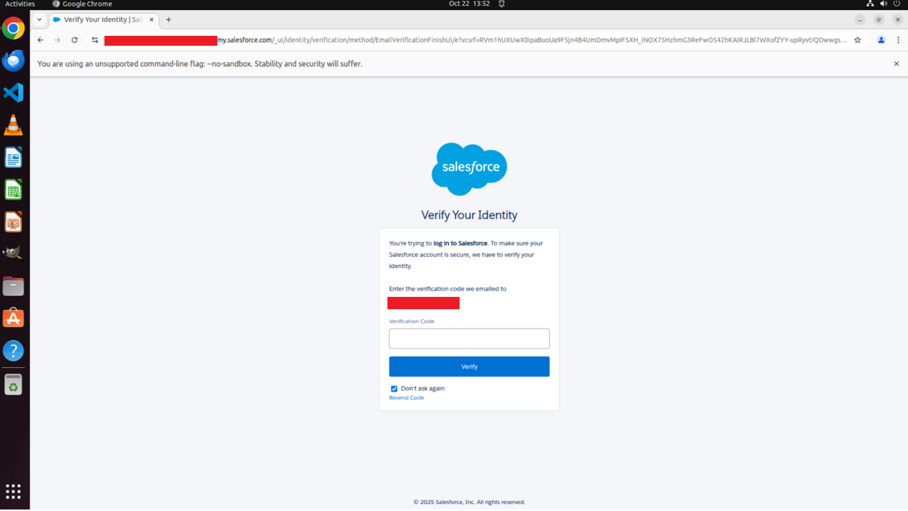
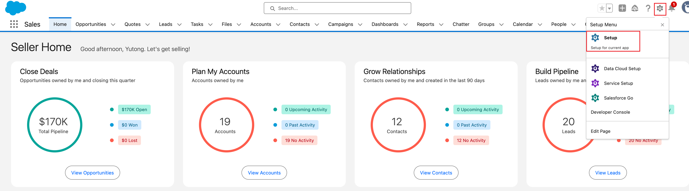
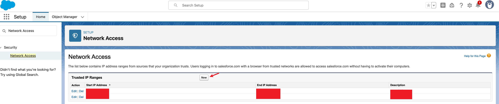

## Temporarily By-pass two-way authentication (New as of 2025-10-23)

If this is your first time logging in to Salesforce, you will be prompted to enter the verification code sent to your email. This is annoying since it will block your agent experiments.



The trick is to manually login to Salesforce once, and save the storage state. Then you can reuse the storage state to bypass the two-way authentication temporarily.

### step 1: manually login to Salesforce
For the browser-use agents, you can run the following command to manually login to Salesforce and save the storage state.  The script will open a browser and login to Salesforce. You should see the page where you can provide the verification code sent to your email. After you enter the code, you will be logged in successfully. Follow the instructions in the terminal to save the storage state.
```bash
python scripts/manual_login_to_sf.py --mode bu --save_storage_state
```

For the computer-use agents, you can run the following command to manually login to Salesforce and save the storage state.
This is a bit more complicated since you need to create a desktop environment first, and then connect to the remote desktop environment's Chrome browser via CDP.
```bash
# create a desktop environment first
python tests/test_create_remote_desktop.py 
# connect to the remote desktop environment's Chrome browser via CDP
python scripts/manual_login_to_sf.py --mode cua --save_storage_state 
```
After running the script, try to use the VNC viewer (normally running on port 8006) to access the remote desktop environment. You should see the Salesforce login page. Enter the verification code sent to your email, and you will be logged in successfully. Follow the instructions in the terminal to save the storage state.


##  step 2: test the login by running the following command
For browser-use agents, you can run the following command to test the login.
```bash
python tests/test_bu_login_sf.py
```
It will open a browser and login to Salesforce. You should see the Salesforce home page without being blocked by the two-way authentication.

For computer-use agents, you can run the following command to test the login.
```bash
python tests/test_cua_login_sf.py
```
You can use the VNC viewer to check if the login is successful. Also you can check the `tmp` directory to see the screenshot of the desktop environment and the screenshot after logging in to Salesforce.

> [!WARNING]
> Unfortunately, you may need to run this step multiple times since the browser states may expire after some time. As far as we know, the browser states remain valid during our tests.

## Temporarily By-pass two-way authentication (Deprecated as of 2025-10-20)
- Click the `Setup` gear icon in the top right corner of the page and click `Setup` under the `Setup Menu`.
- In the `Quick Find` search bar (left side panel), type `Network Access`. And add the `ip address` of your machine to the `Trusted IP Ranges`.
- To get your machine's ip address, you can run `curl ifconfig.me` in the terminal. (The `ip` should be the machine where you launch the browser environment / desktop environment.)




The system might clear the ip address you added after some time. You can add the ip address again by following the same steps.

If you still face the two-way authentication issue, after you whitelist your ip address, then you can try mannual login in to Salesforce, filling the verification code sent to your email. After the login is successful, the system will whitelist your ip address. You may need to run this more than once depending the frequency of the two-way authentication issue. We observed this issue when tetsting in different machines/servers.

1. If you are testing the computer-use agents, please run `python tests/test_create_remote_desktop.py` first on the client side. Then ssh into the GCP server, port forwarding on the port where the VNC server is running (`8006` for example). The you can visit the `localhost:8006` to view the desktop environment you local browser. Then run `python scripts/manual_login_to_sf.py --mode cua` on the client side. You should see the page where you can provide the verification code sent to your email. After the login is successful, the system will whitelist your ip address.

2. If you are testing the browser-use agents, please run `python scripts/manual_login_to_sf.py --mode bu` on the client side. You should see the page where you can provide the verification code sent to your email. After the login is successful, the system will whitelist your ip address.