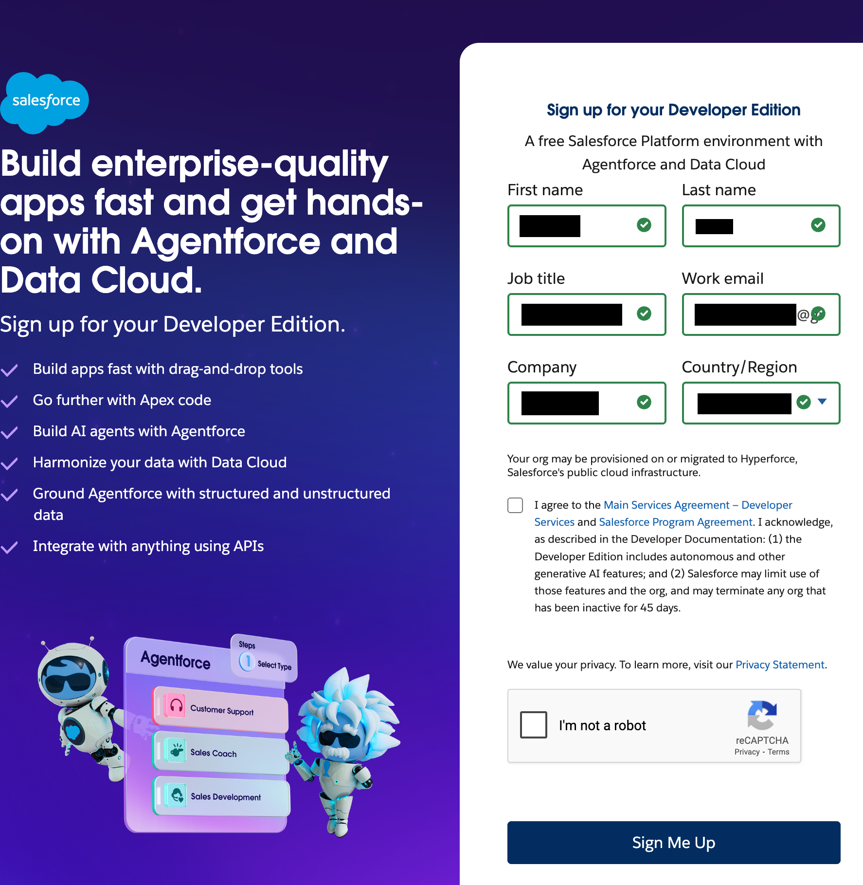
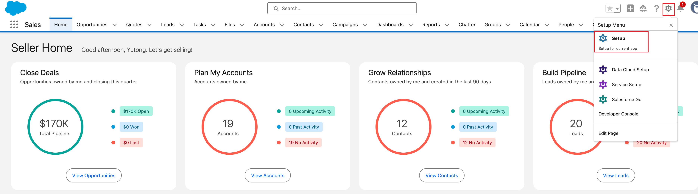

## Apply for a developer org

To apply for a developer org, please visit this [link](https://www.salesforce.com/form/developer-signup/?d=pb). You need to fill the required information and submit the form. Make sure the Work Email is your real email that can receive the verification code. Other fields can be filled with any information. Once the form is submitted, you will receive an email with a link to reset the password.
Please follow the instructions you received by email to access the org.

  
  

## Get your consumer key and secret

- Login to the org via `login.salesforce.com` or use the link in the email you received.
- Go to setup -> search for `External Client App Manager` -> Select it and click on `New External Client App`.

  
  

- Fill in some value for `external client app name`. Take a note of this name, it will be used as the `org alias` (explained later) and `Contact Email` (your real email used to register the org).
- In the `API (Enable OAuth Settings)` section, check the `Enable OAuth` box.
- For `Callback URL`, input `https://login.salesforce.com/services/oauth2/success`.

  

- Select `Full access (full)` for OAuth Scopes and use the arrow button to add under the `Selected OAuth Scopes` section.
- Repated the above step to add `Manage user data via APIs (api)`.
- In the Flow Enablement section, check "Enable Client Credentials Flow", and click `OK` on the Confirm screen.
- Click `Create`.

  

- In the `Policies` tab, click on `Edit` (in the top right corner of this section).

  

- Click `OAuth Policies`. In the `OAuth Flows and External Client App Enhancements` section, check `Enable Client Credentials Flow`.
- In the `Run As (Username)` field, give the `Username` of a System Administrator user, mostly the one you login with, e.g., `xxx@agentforce.com`, and click `Save`. Note this is NOT the email you used to register the org.

  

- Go back to the `Settings` tab, and expand the `OAuth Settings` section. Click on `Consumer Key and Secret` button. This step will require Email verification.

  

- Once the verification is successful, you should be able to see the client/consumer key and secret. Copy these values for the next step.

  

Now, you should have the following values:

- `org_alias`: the value used to fill the `External Client App Name` section. In this example, it is `YDSampleOrg`
- `client_key`: Copied value from Consumer Key
- `client_secret`: Copied value from Consumer Secret
- `username`: value should be the system administrator user you mentioned in the `Run As` field. In this example, it is `xxx@agentforce.com`.
- `instance`: URL of your instance. Make sure this ends with `my.salesforce.com`. You can find this url when you obtain the `Consumer Key and Secret`. In this example, it is `https://orgfarm-ae27993685-dev-ed.develop.my.salesforce.com`

Keep these values for the next step.